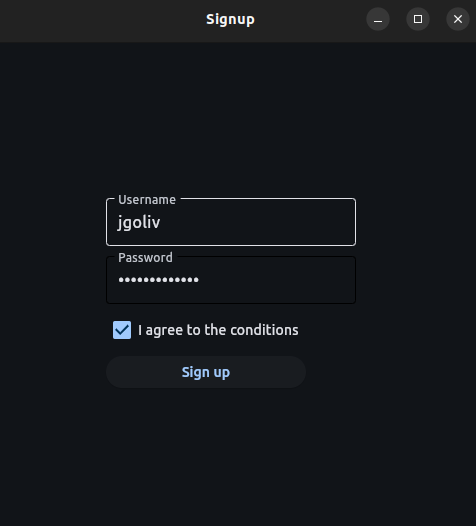

Simple login screen using Flet, created to learn the basics of the framework. The idea was inspired by the *Idently* [youtube video](https://www.youtube.com/watch?v=YWUM1Yx79mE&t=586s).

Here is what it looks like:

To see the functionalities, run the `main.py` script.
